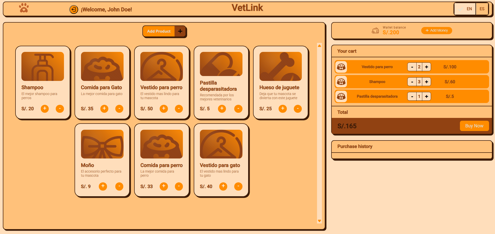
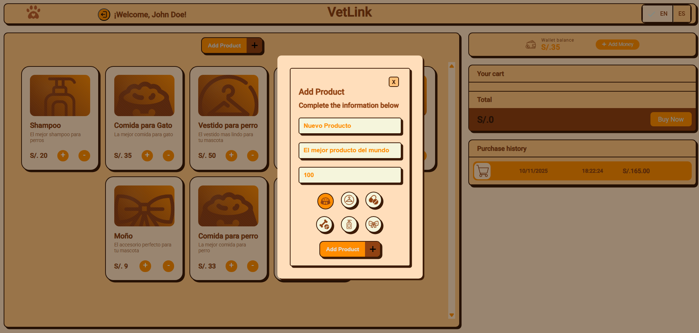
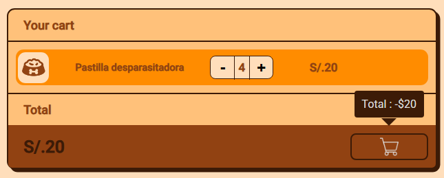
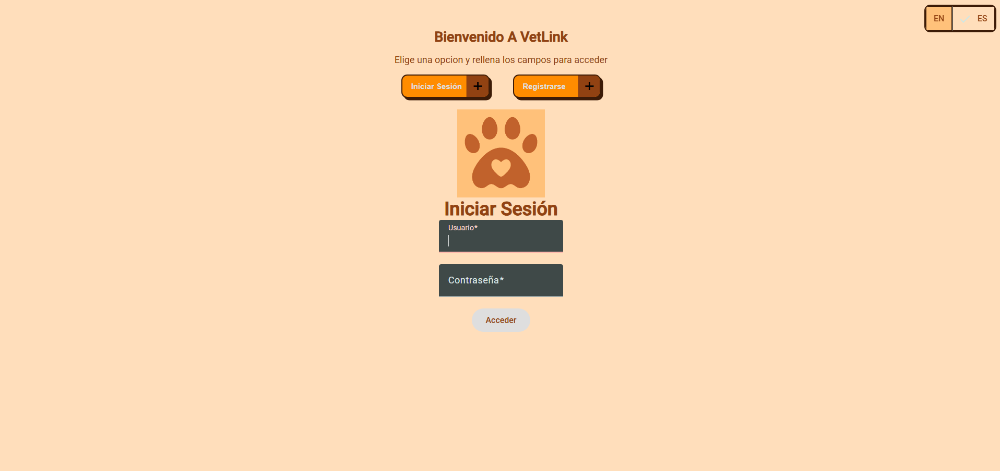

# 🐾 Vetlink — E-commerce Veterinario Académico

**Vetlink** es un proyecto académico desarrollado como práctica para afianzar conocimientos en **Angular**, **arquitectura front-end**, y el uso de **APIs simuladas con JSON Server**.  
La aplicación representa un **e-commerce de productos veterinarios**, donde los usuarios pueden registrarse, iniciar sesión, gestionar productos, realizar compras simuladas y consultar su historial de ventas.

---









---

## ⚙️ Funcionalidades principales

- 🔐 Registro e inicio de sesión de usuarios  
- 🛒 Carrito de compras interactivo  
- 💰 Sistema de billetera virtual (simulada)  
- 🧾 Historial de ventas personal por cuenta  
- 🐕 Publicación, edición y eliminación de productos  
- 🧩 Clasificación de productos (comida, ropa, medicina, juguete, aseo, accesorio)  
- 🌍 Internacionalización **(Español / Inglés)**  
- 🧠 Conexión con **Fake API (JSON Server)** para simular operaciones CRUD

---

## 🧠 Rol y aprendizaje

**Rol:**  
- Desarrollo **frontend completo** con Angular  
- Diseño y estructura de componentes  
- Implementación de comunicación con **Fake API**  
- Práctica de **relaciones tipo cliente-servidor** y manejo de datos simulados  
- Diseño de interfaz y experiencia de usuario (UI/UX)  

**Aprendizajes clave:**  
- Comprensión de arquitectura de una app e-commerce  
- Manejo de estados y flujos de datos  
- Uso de internacionalización (i18n)  
- Diseño modular y escalable en Angular  
- Buenas prácticas con JSON Server para simular un backend  

---

## 🧩 Tecnologías utilizadas

- **Angular 18+**
- **TypeScript**
- **HTML5 / CSS3**
- **JSON Server** *(Fake API para pruebas locales)*
- **Git / GitHub**

---

## 🚀 Cómo ejecutar el proyecto

Asegúrate de tener instalado **Node.js** y **Angular CLI**.

```bash
# Instalar dependencias
npm install

# Moverse al directorio del proyecto
cd vetlink

# Ejecutar la aplicación en modo desarrollo
ng serve
```
Luego abre 👉 http://localhost:4200 en tu navegador.

## ⚙️ Ejecutar la Fake API (JSON Server)

Abre otra terminal (sin cerrar la anterior) y ejecuta:

```bash

# Moverse al directorio del proyecto
cd vetlink

json-server --watch server/db.json

```
Esto inicializa la Fake API, necesaria para las operaciones de productos, carrito e historial.

## 🧩 Flujo básico de uso

1. Crea una cuenta mediante **"Registrarse"**.  
2. Inicia sesión y accede a la tienda.  
3. Agrega o edita productos (nombre, descripción, precio, tipo).  
4. Añade productos al carrito con el botón **"+"** o elimínalos con **"-"**.  
5. Presiona **"Agregar dinero"** para simular fondos.  
6. Realiza una compra y visualízala en tu historial personal.  

> 💡 La aplicación no descarga imágenes reales; el tipo de producto se representa mediante íconos.

---

## 👨‍💻 Autor

**Victor Cruz**  
Estudiante de Ingeniería de Software  
